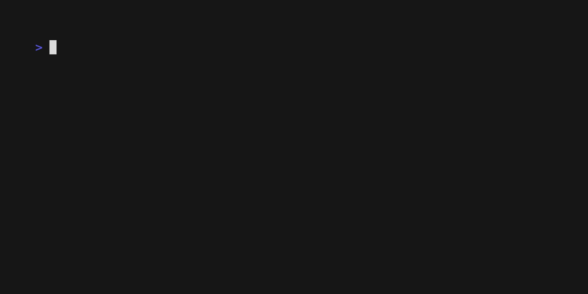

# find_peaks

This is a Python port of the [find_peaks](https://github.com/owenjm/find_peaks) program written in Perl. **And now it runs at a blazing fast speed! (~120 times faster than original)**



## Requirements

This program requires no additional Python package, and will theoretically run in any Python version >=3.6, but a Python version of 3.11 and above is highly recommended as it brings about ~15% performance improvements.

## Usage

The program can be run from the command line with the following syntax:

```
find_peaks.py [-h]
    [--n N] [--fdr FDR] [--frac FRAC]
    [--min_count MIN_COUNT] [--min_quant MIN_QUANT] [--step STEP]
    [--unified_peaks {max,min}]
    [--no_discard_zeros]
    [--seed SEED]
    files [files ...]

Simple FDR random permutation peak caller

positional arguments:
  files                 Input files in bedgraph or GFF format

options:
  -h, --help            show this help message and exit
  --n N                 Number of iterations
  --fdr FDR             False discovery rate value
  --frac FRAC           Fraction of random fragments to consider per iteration (0..1)
  --min_count MIN_COUNT
                        Minimum number of fragments to consider as a peak
  --min_quant MIN_QUANT
                        Minimum quantile for considering peaks
  --step STEP           Stepping for quantiles
  --unified_peaks {max,min}
                        Method for calling peak overlaps (two options): 'min': call minimum overlapping peak area 'max': call maximum overlap as peak
  --no_discard_zeros    Treat zero scores as non-empty reads in raw data
  --seed SEED           Random seed
```

- `N`: The number of random shuffle iterations to perform. The default is `100`. The higher the number, the more accurate the FDR will be, but the longer the program will take to run.
- `FDR`: The false discovery rate to use. The default is `0.01`. This is calculated as the number of occurrence of peaks in the random shuffles over the number of peaks found in the real data.
- `FRAC`: The fraction of the data to be used for calculating random shuffles (where 0 means no truncation). The default is `0`. This is used to speed up the program, as the random shuffles and samples are taken on a subset of the data.
- `MIN_COUNT`: The minimum number of consecutive fragments to consider as a peak. The default is `2`.
- `MIN_QUANT`: The minimum quantile to consider as a peak. The default is `0.95`. Higher values will result in fewer peaks being called thus less noise in output.
- `STEP`: The step size for quantiles. The default is `0.01`. Smaller steps results in finer result at the cost of run speed.
- `UNIFIED_PEAKS`: The method for calling peak overlaps. The default is `max`. If `max`, the maximum overlap is called as the peak thus results in fewer but larger peaks. If `min`, the minimum overlap is called as one peak and results in more but smaller peaks.
- `no_discard_zeros`: If set, treat zero scores as non-empty reads in raw data. The default is `False`. This is useful for data that has a lot of zeros, such as ChIP-seq data.
- `SEED`: Random seed used for shuffling. The default is `0`.

## Examples

- Call peaks on a single `gff` file with default parameters:
  ```bash
  find_peaks.py path/to/file.gff
  ```
- Call peaks on multiple `bedgraph` files with default parameters:
  ```bash
  find_peaks.py path/to/file1.bedgraph path/to/file2.bedgraph
  ```
- Shuffle the first 1k reads for 1000 iterations and filter result by 0.05 false discovery rate:
  ```bash
  find_peaks.py --n 1000 --frac 1000 --fdr 0.05 path/to/file.bedgraph
  ```
- Set random seed to 42:
  ```bash
  find_peaks.py --seed 42 path/to/file.bedgraph
  ```
- Call peaks with minimum 5 consecutive fragments and minimum 0.99 quantile:
  ```bash
  find_peaks.py --min_count 5 --min_quant 0.99 path/to/file.bedgraph
  ```

## Notes

Some modifications and improvements are made to the original Perl program:

|                                                                                                                                                                       Case |                           Perl (original)                           |                                                                Python (this)                                                                |
| -------------------------------------------------------------------------------------------------------------------------------------------------------------------------: | :-----------------------------------------------------------------: | :-----------------------------------------------------------------------------------------------------------------------------------------: |
| No regression result found when calling significant peaks <br/>(e.g. when the random shuffles do not have an enough variety of peak lengths, so no regression can be made) |     Continue by using uninitialized values (undefined behavior)     |                       Skip calling peaks for this peak min value, and will print a warning message to stderr instead                        |
|                                                                                                                                             Random seed used for shuffling |                Use different ones for each execution                |                                           Fixed and can be reset by the user, for reproducibility                                           |
|                                                                                                                                    Processing probe reads with zero scores |        Keep probe reads with zero scores and skip them later        |                          Discard them by default to increase processing speed, yet can be set to keep them by user                          |
|                       Generating random shuffles of fraction of the data <br/>(e.g. when the data is too large to shuffle, or when the user wants to speed up the program) | Use a fixed first few number of the whole and shuffle them in place | Use `random.sample` instead, and the number to sample are calculated through simulated sampling from all reads (including zero-scored ones) |
